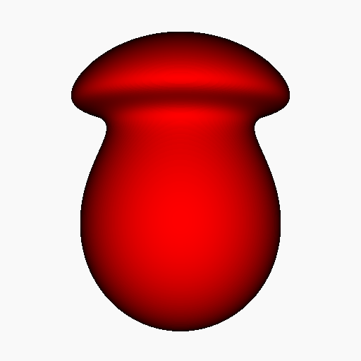

# Render Blobs using Ray Marching
This code shows an implementation of ray marching to render the implicit surface of blobs. 

A blob is defined by a distance function *d* and a fall-off function *g*.

f(p) = g o d(p)

In this example a point distance function is implemented and the Blinn and the Wyvill fall-off functions are used.

The normal vectors are estimated using forward differences.

Example:

# References
James F. Blinn. 1982. A Generalization of Algebraic Surface Drawing. ACM Trans. Graph. 1, 3 (July 1982), 235–256. DOI:https://doi.org/10.1145/357306.357310

Wyvill G., McPheeters C., Wyvill B.: Data structure for soft objects. The Visual Computer 2, 4 (1986), 227–234.